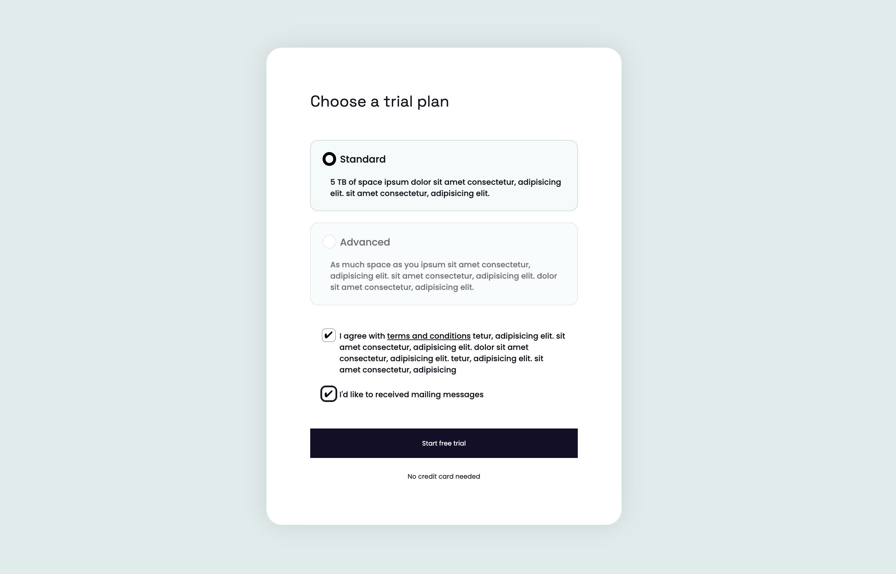

<h1 align="center">Checkbox and Radio Styles 👨🏽‍💻 </h1>

Aplicando técnicas css para estilizar os componentes radio button & checkbox do Html.

  <a href="#-tecnologias">Tecnologias</a>&nbsp;&nbsp;&nbsp;|&nbsp;&nbsp;&nbsp;
  <a href="#-projeto">Projeto</a>&nbsp;&nbsp;&nbsp;|&nbsp;&nbsp;&nbsp;

 

  

## 🚀 Tecnologias

Esse projeto foi desenvolvido com as seguintes tecnologias:

- HTML e CSS
- Git e Github

## 💻 Projeto

O projecto foi desenvolvido com fins didáticos, com o intuito resetar a estilização padrão dos componentes de radio e checkbox do HTML, e criar um novo estilo

Feito com ♥ by Daniel Koti
